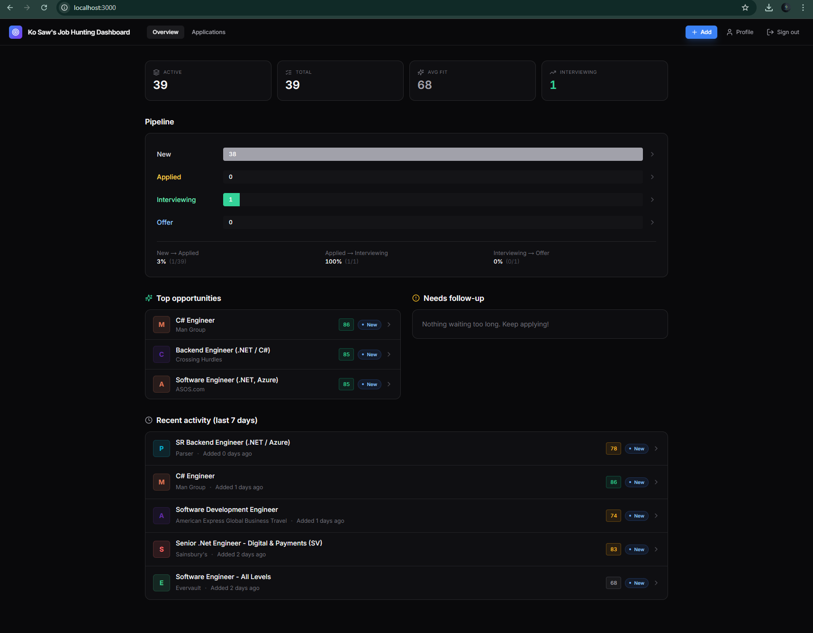
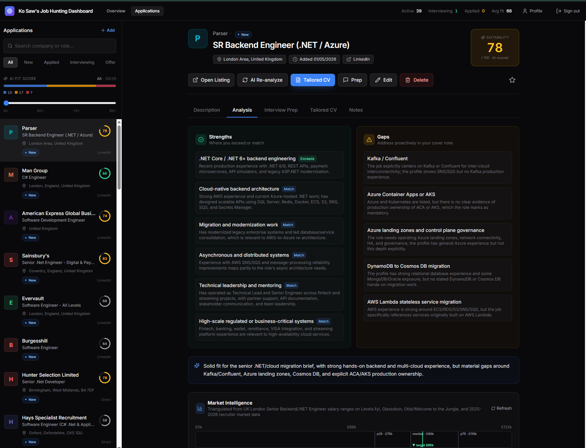
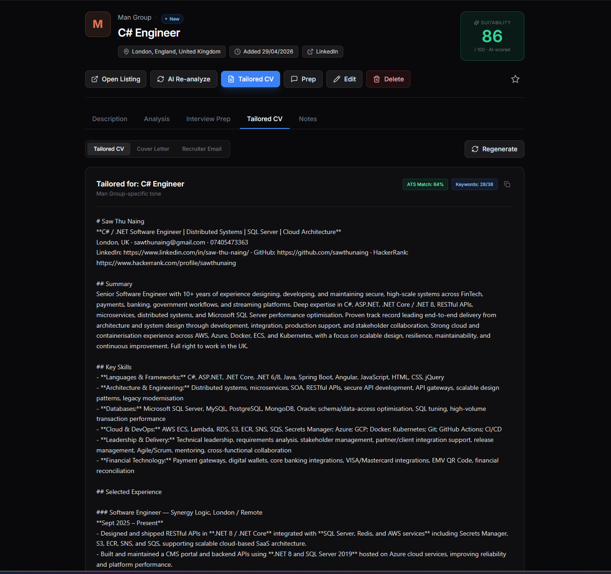
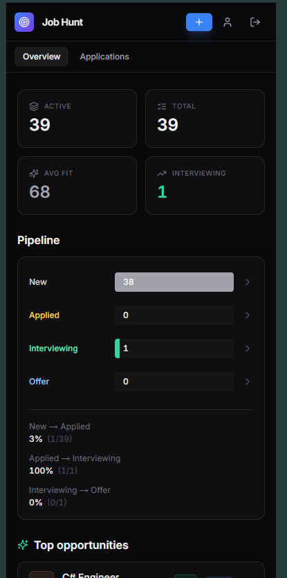
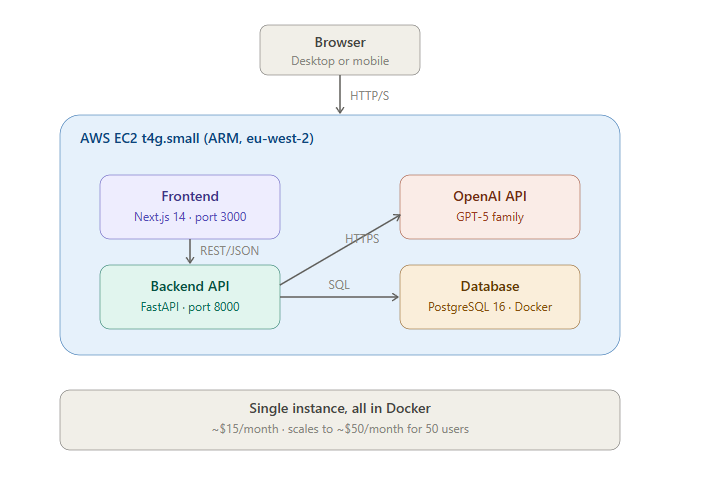

<div align="center">

# Job Hunting AI

### AI-powered job application platform that scores fit, tailors your CV, and preps you for interviews — automatically.

[](http://51.24.16.185:3001)
[](#tech-stack)
[-orange?style=for-the-badge)](#architecture)


</div>

---

## The problem

Every job application takes 2–3 hours: research the company, tailor your CV, prep for interviews, write a cover letter. Repeat 30 times during a job hunt and that's 90 hours of work — most of it lost the moment you submit.

**Job Hunting AI compresses each application from hours to minutes.**

---

## What it does

- **Paste a job URL** — the AI extracts company, role, location, salary range, requirements
- **Get instant fit analysis** — 0–100 suitability score with reasoning, matched/missing skills, red flags
- **Auto-generate tailored CV** — emphasizes the experience relevant to *this specific job*, not a generic resume blast
- **Pre-built interview prep** — likely questions, suggested answers, talking points, salary negotiation tips
- **Track your pipeline** — visual funnel from New → Applied → Interviewing → Offer with conversion rates
- **Score-based prioritization** — filter your pipeline by AI fit score so you focus on the highest-probability roles

---

## Live demo

🔗 **Try it now**: [http://51.24.16.185:3001](http://51.24.16.185:3001)

> The live deployment is currently single-tenant for personal job hunting. A read-only public demo with curated sample data is in development.

---

## Screenshots

<table>
<tr>
<td width="50%">

**Pipeline overview**

Funnel chart, top opportunities, recent activity, follow-up reminders.

</td>
<td width="50%">

**AI fit analysis**

Live 0–100 scoring with matched skills, gaps, and reasoning.

</td>
</tr>
<tr>
<td width="50%">

**Tailored CV per job**

AI rewrites your CV emphasizing the most relevant experience for the target role.

</td>
<td width="50%">

**Mobile-first design**

Full-featured dashboard on iPhone with drawer navigation and full-screen modals.

</td>
</tr>
</table>

---

## Tech stack

<table>
<tr>
<td><b>Frontend</b></td>
<td>Next.js 14 (App Router) · TypeScript · Tailwind CSS · Lucide icons</td>
</tr>
<tr>
<td><b>Backend</b></td>
<td>FastAPI · SQLAlchemy 2.0 · Pydantic v2 · Python 3.12</td>
</tr>
<tr>
<td><b>Database</b></td>
<td>PostgreSQL 16 (containerised, self-hosted)</td>
</tr>
<tr>
<td><b>AI</b></td>
<td>OpenAI GPT-5 family with auto-detection of model-specific parameter conventions</td>
</tr>
<tr>
<td><b>Auth</b></td>
<td>JWT (HS256) — custom implementation, no external auth provider</td>
</tr>
<tr>
<td><b>Infrastructure</b></td>
<td>Docker · Docker Compose · AWS EC2 (ARM Graviton t4g.small) · Terraform</td>
</tr>
<tr>
<td><b>CI/CD</b></td>
<td>Manual <code>git push</code> + <code>docker compose up --build</code> on EC2 (intentional simplicity for solo project)</td>
</tr>
</table>

---

## Architecture



### Why this design

**Single ARM EC2 instance, all services in Docker on the same host.**

| Decision | Rationale |
|---|---|
| ARM Graviton (`t4g.small`) | ~40% cheaper than x86 equivalent, plenty of headroom for personal use |
| Postgres in Docker (not RDS) | RDS adds £15/month; Docker Postgres + automated backups gives 90% of the value at 5% of the cost |
| No load balancer / no auto-scaling | Single user, single region. Adding LBs is premature optimisation |
| Manual deploys via `git pull` | One developer, one server. CI/CD pipeline complexity not justified |
| Custom JWT auth (not Cognito/Auth0) | One user, one password. External auth providers are overkill |
| Cost target: ~$15/month | Personal project economics; would scale to ~$50/month for 50 users |

### AI integration deep-dive

The core differentiator is **adaptive model handling**. GPT-5 family models have inconsistent parameter conventions (`max_tokens` vs `max_completion_tokens`, temperature support varies, JSON mode availability differs). Rather than hard-coding for one model, the backend probes capabilities at first call and caches the quirks per model:

```python
# Per-model capability cache - probed once, used forever
_MODEL_QUIRKS_CACHE: dict[str, ModelQuirks] = {}

def _call_with_quirks(system: str, user: str, ...) -> str:
    quirks = _detect_model_quirks(model_name)
    kwargs = {"messages": [...]}
    if quirks.supports_temperature:
        kwargs["temperature"] = 0.3
    kwargs[quirks.tokens_param] = max_output_tokens
    if quirks.supports_json_mode:
        kwargs["response_format"] = {"type": "json_object"}
    return openai_client.chat.completions.create(**kwargs)
```

This means swapping models (gpt-5.5 → gpt-5.4-mini → gpt-5.4-nano) for cost optimisation is a one-line config change with zero code modifications.

### Cost analysis (per-user economics)

| Model | Cost per job analysed | Cost per active user / month (20 jobs) |
|---|---|---|
| gpt-5.5 | ~$0.38 | ~$7.60 |
| gpt-5.4-mini | ~$0.06 | ~$1.20 (recommended for production) |
| gpt-5.4-nano | ~$0.02 | ~$0.40 (sufficient for simple extraction) |

A SaaS deployment using gpt-5.4-mini with £9.99/month pricing yields ~70% gross margin per user.

---

## Key features

### 🎯 AI-powered URL extraction

Paste a job listing URL from LinkedIn, Indeed, Otta, Workday, or any company careers page. The backend scrapes the page, sanitises the HTML, and feeds it to GPT for structured extraction:

- Company name, role title, location, work type (remote/hybrid/onsite)
- Salary range with currency normalisation
- Required vs preferred skills
- Application URL
- Platform identification

### ✨ Suitability scoring

For each job, the AI compares the JD against your saved profile (CV, skills, salary expectations, deal-breakers) and outputs:

- **0–100 score** with category-band visualisation
- **Matched skills** — what the JD asks for that you have
- **Skill gaps** — what's required that you lack
- **Reasoning** — paragraph explanation of the fit
- **Salary alignment** — flag if the offered range conflicts with your target

### 📊 Pipeline overview with conversion rates

Visual funnel showing your application flow:

```
New           ████████ 8
Applied       ██████ 7      → 88% conversion
Interviewing  ████ 3        → 43% conversion
Offer         █ 1           → 33% conversion
```

Click any stage to filter the application list. Identify where you're losing applications.

### 🔍 Score-based filtering with histogram

Score histogram in the sidebar showing distribution of all applications by AI fit score. Slider to filter by minimum score (e.g., "show me only 75+ matches"). Tap any colored band to jump-filter.

### 📱 Mobile-first responsive design

Full feature parity on mobile:
- Hamburger drawer sidebar (slides in from left, backdrop overlay)
- Full-screen modal sheets for job entry on mobile
- Horizontally-scrollable tab strips
- Sticky bottom action zones thumb-friendly tap targets (44px+ per Apple HIG)
- iOS-aware viewport handling (`dvh` units to handle Safari URL bar showing/hiding)

---

## What I'd change for production

This was built for personal use. To productise it for multi-tenancy, the changes I'd make:

| Layer | Current | Production |
|---|---|---|
| **Auth** | Single hardcoded user | OAuth 2.0 (Google/LinkedIn sign-in), per-user data isolation |
| **DB** | Single Postgres in Docker | Managed Postgres (Aurora Serverless v2) with point-in-time restore |
| **AI rate limiting** | None | Per-user token budgets + Redis-based sliding-window rate limit |
| **Cost protection** | OpenAI billing limit | Per-user spend caps + cached responses for identical inputs |
| **Compute** | Single EC2 | ECS Fargate with auto-scaling on a load balancer |
| **CDN** | None | CloudFront in front of frontend, static asset caching |
| **Observability** | `docker logs` | Sentry for errors, CloudWatch for metrics, structured logging |
| **CI/CD** | Manual SSH | GitHub Actions → ECR → ECS deploy automation |
| **Backups** | Manual SQL dumps | Automated nightly to S3 with 30-day retention |

The current cost (~$15/month) would scale roughly linearly with users until ~500, where the architecture would need to shift to ECS for proper isolation.

---

## How to run it locally

### Prerequisites
- Docker Desktop
- An OpenAI API key

### Setup

```bash
git clone https://github.com/sawthunaing/stn-job-hunting-dashboard-with-ai.git
cd stn-job-hunting-dashboard-with-ai

# Configure
cp backend/config.example.json backend/config.json
# Edit backend/config.json - add your OpenAI key, set admin_username and admin_password

# Run
docker compose up -d --build
```

Open http://localhost:3000. Log in with the credentials you set in `config.json`.

### First-time setup

1. Visit `/profile` and fill in your CV details (this is what the AI uses for tailoring)
2. Click **+ Add** in the sidebar
3. Paste any job URL — the AI extracts everything
4. Click **AI Re-analyze** on the job to compute fit score

---

## Project structure

```
.
├── backend/
│   ├── app/
│   │   ├── main.py          # FastAPI routes
│   │   ├── models.py        # SQLAlchemy ORM models
│   │   ├── schemas.py       # Pydantic request/response shapes
│   │   ├── ai.py            # OpenAI integration with model quirk detection
│   │   ├── scraper.py       # BeautifulSoup-based URL extraction
│   │   ├── auth.py          # JWT issuance and verification
│   │   └── db.py            # SQLAlchemy session + lightweight migrations
│   ├── Dockerfile
│   └── requirements.txt
├── frontend/
│   └── src/
│       ├── app/
│       │   ├── page.tsx              # Pipeline overview (home)
│       │   ├── applications/         # Job list + detail
│       │   ├── profile/              # User profile editor
│       │   └── login/                # JWT login
│       ├── components/
│       │   ├── Sidebar.tsx           # Mobile drawer + AI score filter
│       │   ├── tabs/                 # Per-job AI feature tabs
│       │   └── ...
│       └── lib/
│           └── api.ts                # Typed API client
├── infra/
│   ├── main.tf                       # EC2 + security groups (Terraform)
│   └── README.md                     # Deploy instructions
└── docker-compose.yml                # Local dev (hot reload)
└── docker-compose.prod.yml           # EC2 production
```

---

## About the author

Built by **Saw Thu Naing** — Senior Software Engineer specialising in C# / .NET, distributed systems, and FinTech infrastructure.

10+ years building secure, high-scale systems across payment platforms (VISA, Mastercard, Alipay, WeChat), digital wallets, banking integrations, and live streaming. Currently based in London, UK.

- 🌐 LinkedIn: [linkedin.com/in/saw-thu-naing](https://www.linkedin.com/in/saw-thu-naing/)
- 🐙 GitHub: [github.com/sawthunaing](https://github.com/sawthunaing)
- 🏆 HackerRank: [hackerrank.com/profile/sawthunaing](https://www.hackerrank.com/profile/sawthunaing)
- ✉️ Email: sawthunaing@gmail.com

**Certifications:**
- Google Professional Cloud Architect
- AWS Certified Solutions Architect — Associate

---

## License

MIT — see [LICENSE](LICENSE).

---

<div align="center">

If you found this useful, ⭐ the repo or [reach out](https://www.linkedin.com/in/saw-thu-naing/) — always open to interesting engineering conversations.

</div>
